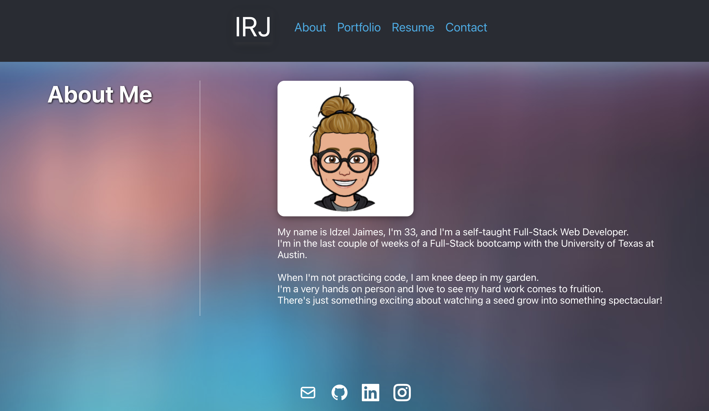
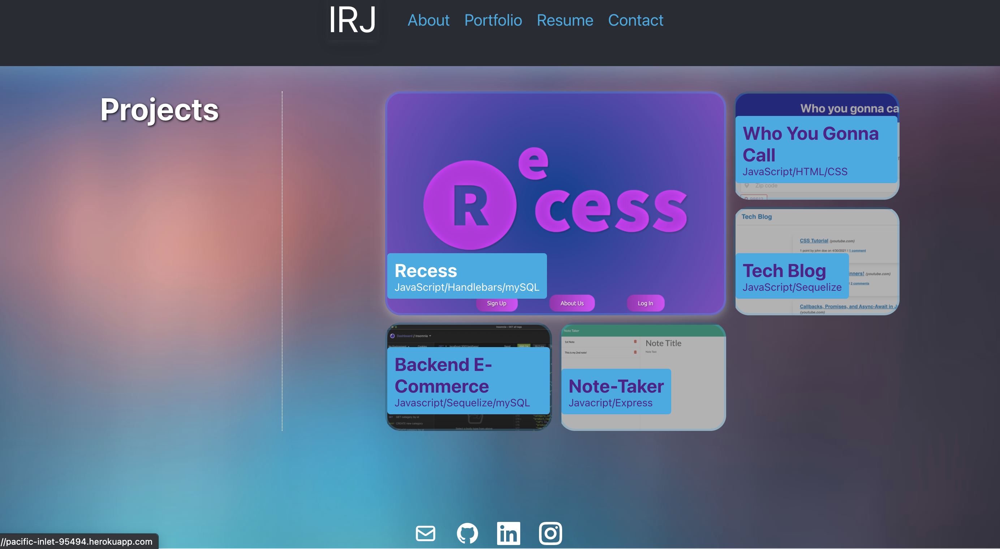
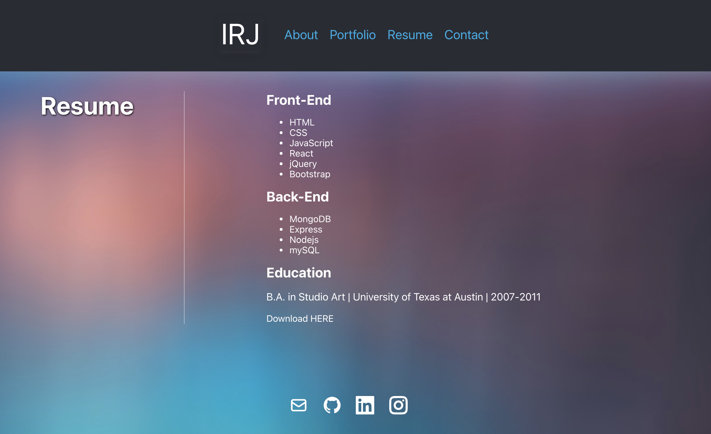
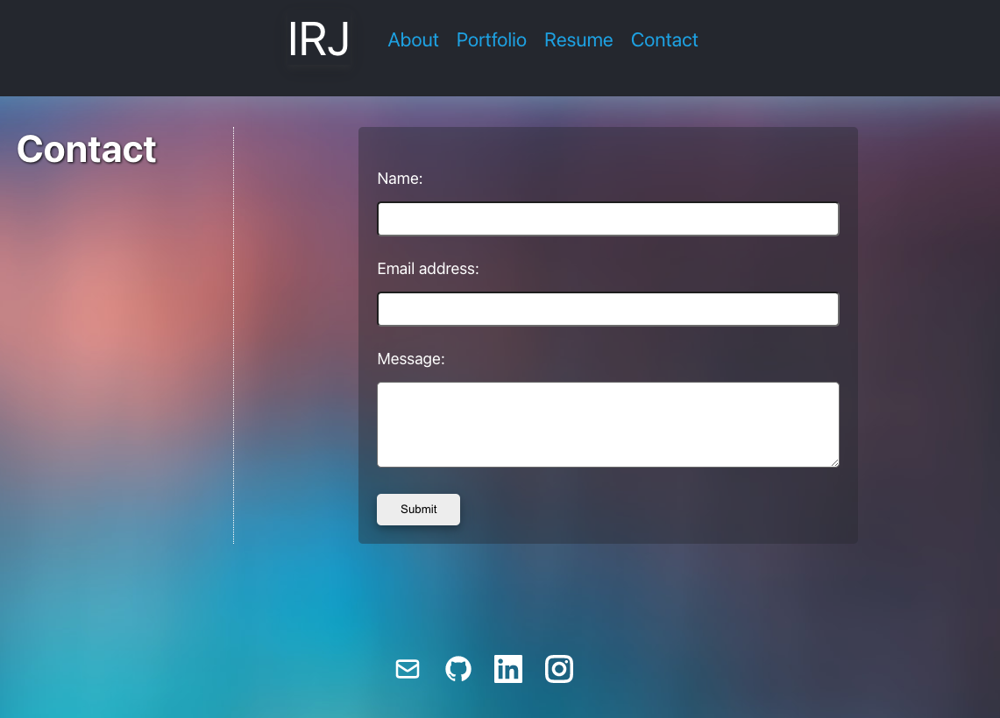

# react-port

## Description

This is a simple React porfolio.

Deployed App can be found [here](http....)

## Table of Contents

- [Description](#description)
- [Installation](#installation)
- [Usage](#usage)
- [License](#license)
- [Questions](#questions)

## Installation Instructions

## Usage Information

Dependencies for this application include: react and react icons.

## License

## Questions

For any questions, please feel free to contact me.

- Github Username: [irjaimes](https://github.com/irjaimes/react-port)
- Email : irjaimes@outlook.com
